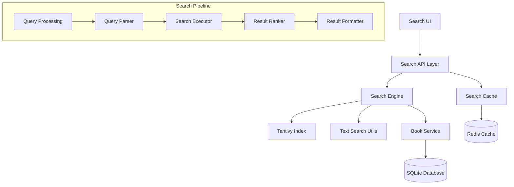

# Design Document

## Overview

O Sistema de Busca Avançada do ePubReader é projetado para fornecer capacidades de busca de alta performance para bibliotecas digitais com mais de 100.000 livros. O sistema utiliza uma arquitetura híbrida combinando busca em tempo real, indexação full-text com Tantivy, e caching inteligente para garantir latência inferior a 100ms para buscas básicas e inferior a 500ms para buscas complexas.

## Architecture

### High-Level Architecture



### Component Architecture

O sistema é estruturado em camadas para separar responsabilidades e permitir escalabilidade:

1. **Presentation Layer**: Interface Slint para entrada de busca e exibição de resultados
2. **API Layer**: Coordenação de buscas e gerenciamento de cache
3. **Search Engine Layer**: Processamento de consultas e execução de buscas
4. **Storage Layer**: Índices Tantivy e banco de dados SQLite
5. **Caching Layer**: Cache em memória LRU e Redis opcional

## Components and Interfaces

### 1. Search Service Interface

```rust
pub trait SearchService {
    async fn search_books(&self, query: SearchQuery) -> Result<SearchResults>;
    async fn search_content(&self, book_id: &str, query: ContentQuery) -> Result<ContentResults>;
    async fn get_suggestions(&self, partial_query: &str) -> Result<Vec<String>>;
    async fn get_search_history(&self, user_id: &str) -> Result<Vec<SearchHistory>>;
    async fn build_index(&self, book_id: &str) -> Result<()>;
    async fn update_index(&self, book_id: &str, content: &str) -> Result<()>;
}
```

### 2. Query Processing Components

#### SearchQuery Structure
```rust
pub struct SearchQuery {
    pub text: String,
    pub filters: SearchFilters,
    pub options: SearchOptions,
    pub pagination: Pagination,
}

pub struct SearchFilters {
    pub authors: Vec<String>,
    pub genres: Vec<String>,
    pub date_range: Option<DateRange>,
    pub reading_status: Option<ReadingStatus>,
    pub collections: Vec<String>,
}

pub struct SearchOptions {
    pub fuzzy_matching: bool,
    pub case_sensitive: bool,
    pub whole_words: bool,
    pub regex_mode: bool,
    pub max_results: usize,
    pub include_content: bool,
}
```

#### Query Parser
```rust
pub struct QueryParser {
    pub fn parse(&self, query: &str) -> ParsedQuery;
    pub fn extract_filters(&self, query: &str) -> SearchFilters;
    pub fn detect_query_type(&self, query: &str) -> QueryType;
}

pub enum QueryType {
    Simple,
    Boolean,
    Phrase,
    Regex,
    Fuzzy,
}
```

### 3. Search Engine Components

#### Tantivy Integration
```rust
pub struct TantivySearchEngine {
    schema: Schema,
    index: Index,
    reader: IndexReader,
    writer: IndexWriter,
}

impl TantivySearchEngine {
    pub async fn search_full_text(&self, query: &str) -> Result<Vec<TantivyResult>>;
    pub async fn search_with_filters(&self, query: &ParsedQuery) -> Result<Vec<TantivyResult>>;
    pub async fn add_document(&self, book: &Book) -> Result<()>;
    pub async fn update_document(&self, book_id: &str, book: &Book) -> Result<()>;
    pub async fn delete_document(&self, book_id: &str) -> Result<()>;
}
```

#### Fuzzy Search Engine
```rust
pub struct FuzzySearchEngine {
    pub fn search_fuzzy(&self, query: &str, threshold: f32) -> Result<Vec<FuzzyMatch>>;
    pub fn calculate_similarity(&self, text1: &str, text2: &str) -> f32;
    pub fn generate_suggestions(&self, query: &str, dictionary: &[String]) -> Vec<String>;
}
```

### 4. Caching System

#### Multi-Level Cache
```rust
pub struct SearchCache {
    l1_cache: Arc<RwLock<LruCache<String, SearchResults>>>,
    l2_cache: Option<RedisClient>,
    ttl: Duration,
}

impl SearchCache {
    pub async fn get(&self, key: &str) -> Option<SearchResults>;
    pub async fn set(&self, key: &str, results: SearchResults) -> Result<()>;
    pub async fn invalidate(&self, pattern: &str) -> Result<()>;
    pub async fn clear_all(&self) -> Result<()>;
}
```

#### Cache Strategy
- **L1 Cache**: LRU em memória para 1000 consultas mais recentes
- **L2 Cache**: Redis opcional para cache distribuído
- **TTL**: 1 hora para resultados de busca, 24 horas para índices
- **Invalidation**: Baseada em eventos de modificação de livros

### 5. Performance Monitoring

#### Search Analytics
```rust
pub struct SearchAnalytics {
    pub fn record_search(&self, query: &str, duration: Duration, result_count: usize);
    pub fn record_cache_hit(&self, query: &str);
    pub fn record_cache_miss(&self, query: &str);
    pub fn get_performance_metrics(&self) -> PerformanceMetrics;
}

pub struct PerformanceMetrics {
    pub average_response_time: Duration,
    pub cache_hit_rate: f32,
    pub popular_queries: Vec<String>,
    pub slow_queries: Vec<SlowQuery>,
}
```

## Data Models

### Search Index Schema (Tantivy)

```rust
pub fn create_search_schema() -> Schema {
    let mut schema_builder = Schema::builder();
    
    // Book metadata fields
    schema_builder.add_text_field("book_id", STRING | STORED);
    schema_builder.add_text_field("title", TEXT | STORED);
    schema_builder.add_text_field("author", TEXT | STORED);
    schema_builder.add_text_field("genre", STRING | STORED);
    schema_builder.add_date_field("publication_date", INDEXED | STORED);
    
    // Content fields
    schema_builder.add_text_field("content", TEXT);
    schema_builder.add_text_field("chapter_titles", TEXT | STORED);
    
    // Search optimization fields
    schema_builder.add_u64_field("word_count", INDEXED | STORED);
    schema_builder.add_f64_field("reading_level", INDEXED | STORED);
    
    schema_builder.build()
}
```

### Search Result Models

```rust
pub struct SearchResults {
    pub query: String,
    pub total_results: usize,
    pub results: Vec<SearchResult>,
    pub facets: SearchFacets,
    pub suggestions: Vec<String>,
    pub search_time: Duration,
}

pub struct SearchResult {
    pub book_id: String,
    pub title: String,
    pub author: String,
    pub relevance_score: f32,
    pub highlights: Vec<Highlight>,
    pub snippet: String,
}

pub struct Highlight {
    pub field: String,
    pub text: String,
    pub start_offset: usize,
    pub end_offset: usize,
}
```

## Error Handling

### Error Types

```rust
#[derive(Debug, thiserror::Error)]
pub enum SearchError {
    #[error("Query parsing failed: {0}")]
    QueryParseError(String),
    
    #[error("Index operation failed: {0}")]
    IndexError(#[from] tantivy::TantivyError),
    
    #[error("Cache operation failed: {0}")]
    CacheError(String),
    
    #[error("Search timeout after {timeout:?}")]
    TimeoutError { timeout: Duration },
    
    #[error("Invalid search parameters: {0}")]
    InvalidParameters(String),
}
```

### Error Recovery Strategy

1. **Graceful Degradation**: Se Tantivy falhar, usar busca básica de texto
2. **Cache Fallback**: Se cache falhar, executar busca direta
3. **Timeout Handling**: Cancelar buscas que excedem 5 segundos
4. **Retry Logic**: Tentar novamente operações de índice até 3 vezes
5. **User Feedback**: Mostrar mensagens de erro amigáveis ao usuário

## Testing Strategy

### Unit Tests

```rust
#[cfg(test)]
mod tests {
    use super::*;
    
    #[tokio::test]
    async fn test_simple_search() {
        let search_service = create_test_search_service().await;
        let query = SearchQuery::new("rust programming");
        let results = search_service.search_books(query).await.unwrap();
        assert!(!results.results.is_empty());
    }
    
    #[tokio::test]
    async fn test_fuzzy_search() {
        let search_service = create_test_search_service().await;
        let query = SearchQuery::new("programing"); // typo
        let results = search_service.search_books(query).await.unwrap();
        assert!(results.suggestions.contains(&"programming".to_string()));
    }
    
    #[tokio::test]
    async fn test_performance_requirements() {
        let search_service = create_test_search_service().await;
        let start = Instant::now();
        let query = SearchQuery::new("test query");
        let _results = search_service.search_books(query).await.unwrap();
        let duration = start.elapsed();
        assert!(duration < Duration::from_millis(100));
    }
}
```

### Integration Tests

```rust
#[tokio::test]
async fn test_full_search_pipeline() {
    // Test complete search workflow
    let app = create_test_app().await;
    
    // Index test books
    app.index_book("test_book_1").await.unwrap();
    app.index_book("test_book_2").await.unwrap();
    
    // Perform search
    let results = app.search("rust").await.unwrap();
    
    // Verify results
    assert!(results.total_results > 0);
    assert!(results.search_time < Duration::from_millis(500));
}
```

### Performance Tests

```rust
#[tokio::test]
async fn test_large_library_performance() {
    let search_service = create_search_service_with_large_library().await;
    
    // Test with 100k books
    for i in 0..1000 {
        let query = format!("test query {}", i);
        let start = Instant::now();
        let _results = search_service.search_books(SearchQuery::new(&query)).await.unwrap();
        let duration = start.elapsed();
        assert!(duration < Duration::from_millis(500));
    }
}
```

### Load Tests

```rust
#[tokio::test]
async fn test_concurrent_searches() {
    let search_service = Arc::new(create_test_search_service().await);
    let mut handles = vec![];
    
    // Simulate 100 concurrent searches
    for i in 0..100 {
        let service = search_service.clone();
        let handle = tokio::spawn(async move {
            let query = SearchQuery::new(&format!("concurrent test {}", i));
            service.search_books(query).await
        });
        handles.push(handle);
    }
    
    // Wait for all searches to complete
    for handle in handles {
        let result = handle.await.unwrap();
        assert!(result.is_ok());
    }
}
```

## Performance Optimization

### Indexing Strategy

1. **Incremental Indexing**: Apenas reindexar conteúdo modificado
2. **Background Indexing**: Indexar novos livros em background
3. **Index Sharding**: Dividir índices grandes em shards menores
4. **Compression**: Comprimir índices para reduzir uso de disco

### Query Optimization

1. **Query Caching**: Cache de consultas frequentes
2. **Result Pagination**: Carregar resultados sob demanda
3. **Field Selection**: Buscar apenas campos necessários
4. **Early Termination**: Parar busca quando limite é atingido

### Memory Management

1. **LRU Eviction**: Remover resultados menos usados do cache
2. **Memory Monitoring**: Monitorar uso de memória e ajustar cache
3. **Lazy Loading**: Carregar conteúdo de livros sob demanda
4. **Resource Cleanup**: Limpar recursos não utilizados automaticamente

## Security Considerations

### Input Validation

```rust
pub fn validate_search_query(query: &str) -> Result<(), SearchError> {
    if query.len() > 1000 {
        return Err(SearchError::InvalidParameters("Query too long".to_string()));
    }
    
    if query.contains("../") || query.contains("..\\") {
        return Err(SearchError::InvalidParameters("Invalid characters".to_string()));
    }
    
    Ok(())
}
```

### Rate Limiting

```rust
pub struct RateLimiter {
    requests_per_minute: u32,
    user_requests: HashMap<String, Vec<Instant>>,
}

impl RateLimiter {
    pub fn check_rate_limit(&mut self, user_id: &str) -> bool {
        // Implementation of rate limiting logic
        true
    }
}
```

### Data Privacy

1. **Query Anonymization**: Não armazenar consultas com informações pessoais
2. **Secure Logging**: Logs não devem conter dados sensíveis
3. **Access Control**: Verificar permissões antes de executar buscas
4. **Data Encryption**: Criptografar índices sensíveis

## Deployment Considerations

### Configuration

```toml
[search]
tantivy_index_path = "~/.epubreader/search_index"
cache_size_mb = 512
max_concurrent_searches = 50
search_timeout_seconds = 5
enable_fuzzy_search = true
fuzzy_threshold = 0.8

[performance]
index_writer_memory_mb = 256
merge_policy = "log"
enable_compression = true
background_indexing = true
```

### Monitoring

1. **Metrics Collection**: Coletar métricas de performance em tempo real
2. **Health Checks**: Verificar saúde dos índices e cache
3. **Alerting**: Alertas para performance degradada
4. **Logging**: Logs estruturados para debugging

### Scalability

1. **Horizontal Scaling**: Suporte para múltiplas instâncias
2. **Load Balancing**: Distribuir carga entre instâncias
3. **Index Replication**: Replicar índices para alta disponibilidade
4. **Graceful Shutdown**: Finalizar operações em andamento antes de parar