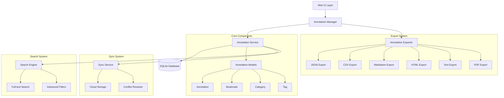

# Design Document

## Overview

O Sistema de Anotações Abrangente é projetado para fornecer uma experiência completa de anotação durante a leitura, incluindo destaques, notas, marcadores e organização avançada. O sistema suporta sincronização em tempo real, exportação em múltiplos formatos, busca avançada e colaboração entre usuários.

## Architecture

### High-Level Architecture



### Component Architecture

O sistema é estruturado em camadas especializadas:

1. **Presentation Layer**: Interface Slint para criação e visualização de anotações
2. **Management Layer**: Coordenação entre UI e serviços de dados
3. **Service Layer**: Lógica de negócio e persistência de dados
4. **Export Layer**: Geração de exports em múltiplos formatos
5. **Sync Layer**: Sincronização entre dispositivos e resolução de conflitos

## Components and Interfaces

### 1. Annotation Models

```rust
pub struct Annotation {
    pub id: String,
    pub book_id: String,
    pub page_number: u32,
    pub selected_text: String,
    pub note: Option<String>,
    pub color: HighlightColor,
    pub created_at: DateTime<Utc>,
    pub modified_at: DateTime<Utc>,
    pub position: TextPosition,
    pub tags: Vec<String>,
    pub category: Option<String>,
    pub annotation_type: AnnotationType,
    pub formatting: Option<TextFormatting>,
    pub is_favorite: bool,
    pub cross_references: Vec<String>,
}

pub struct TextPosition {
    pub start_offset: usize,
    pub end_offset: usize,
    pub paragraph_index: usize,
    pub chapter_id: Option<String>,
    pub line_number: Option<u32>,
    pub column_number: Option<u32>,
}

pub enum AnnotationType {
    Highlight,
    Note,
    Bookmark,
    Underline,
    Strikethrough,
    Question,
    Important,
    Reference,
}
```

### 2. Annotation Service Interface

```rust
pub trait AnnotationService {
    async fn save_annotation(&self, annotation: &Annotation) -> Result<()>;
    async fn get_annotation(&self, id: &str) -> Result<Option<Annotation>>;
    async fn get_annotations_for_book(&self, book_id: &str) -> Result<Vec<Annotation>>;
    async fn get_annotations_filtered(&self, filter: &AnnotationFilter) -> Result<Vec<Annotation>>;
    async fn update_annotation(&self, annotation: &Annotation) -> Result<()>;
    async fn delete_annotation(&self, id: &str) -> Result<()>;
    async fn search_annotations(&self, query: &str) -> Result<Vec<Annotation>>;
    async fn export_annotations(&self, book_id: &str, options: &ExportOptions) -> Result<String>;
    async fn get_annotation_stats(&self, book_id: Option<&str>) -> Result<AnnotationStats>;
}
```

### 3. Rich Text Formatting

```rust
pub struct TextFormatting {
    pub bold: bool,
    pub italic: bool,
    pub underline: bool,
    pub strikethrough: bool,
    pub font_size: Option<u16>,
    pub font_color: Option<String>,
    pub background_color: Option<String>,
}

pub struct RichTextEditor {
    pub content: String,
    pub formatting: Vec<FormatRange>,
    pub cursor_position: usize,
    pub selection: Option<TextRange>,
}

impl RichTextEditor {
    pub fn apply_formatting(&mut self, range: TextRange, format: TextFormatting);
    pub fn insert_text(&mut self, text: &str);
    pub fn delete_range(&mut self, range: TextRange);
    pub fn get_formatted_html(&self) -> String;
    pub fn get_plain_text(&self) -> String;
}
```

### 4. Advanced Search and Filtering

```rust
pub struct AnnotationFilter {
    pub book_id: Option<String>,
    pub annotation_type: Option<AnnotationType>,
    pub color: Option<HighlightColor>,
    pub category: Option<String>,
    pub tags: Vec<String>,
    pub date_range: Option<(DateTime<Utc>, DateTime<Utc>)>,
    pub text_search: Option<String>,
    pub is_favorite: Option<bool>,
}

pub struct AnnotationSearchEngine {
    pub fn search(&self, query: &SearchQuery) -> Result<Vec<AnnotationSearchResult>>;
    pub fn build_index(&self, annotations: &[Annotation]) -> Result<()>;
    pub fn suggest_tags(&self, partial: &str) -> Vec<String>;
    pub fn get_related_annotations(&self, annotation_id: &str) -> Result<Vec<Annotation>>;
}

pub struct SearchQuery {
    pub text: String,
    pub filters: AnnotationFilter,
    pub sort_by: AnnotationSortBy,
    pub limit: Option<usize>,
    pub highlight_matches: bool,
}
```

### 5. Export System

```rust
pub struct AnnotationExporter {
    pub fn export(&self, annotations: &[Annotation], options: &ExportOptions) -> Result<String>;
    pub fn export_to_file(&self, annotations: &[Annotation], options: &ExportOptions, path: &Path) -> Result<()>;
    pub fn get_supported_formats() -> Vec<ExportFormat>;
    pub fn validate_export_options(&self, options: &ExportOptions) -> Result<()>;
}

pub struct ExportOptions {
    pub format: ExportFormat,
    pub include_highlights: bool,
    pub include_notes: bool,
    pub include_bookmarks: bool,
    pub include_timestamps: bool,
    pub include_page_numbers: bool,
    pub include_context: bool,
    pub group_by_chapter: bool,
    pub sort_by: AnnotationSortBy,
    pub template: Option<String>,
}

pub enum ExportFormat {
    Json,
    Csv,
    Markdown,
    Html,
    Pdf,
    Txt,
    Docx,
    Epub,
}
```

### 6. Synchronization System

```rust
pub struct AnnotationSyncService {
    pub async fn sync_annotations(&self, book_id: &str) -> Result<SyncResult>;
    pub async fn push_changes(&self, changes: &[AnnotationChange]) -> Result<()>;
    pub async fn pull_changes(&self, since: DateTime<Utc>) -> Result<Vec<AnnotationChange>>;
    pub async fn resolve_conflicts(&self, conflicts: &[SyncConflict]) -> Result<Vec<Annotation>>;
    pub async fn get_sync_status(&self, book_id: &str) -> Result<SyncStatus>;
}

pub struct SyncConflict {
    pub annotation_id: String,
    pub local_version: Annotation,
    pub remote_version: Annotation,
    pub conflict_type: ConflictType,
    pub resolution_strategy: ConflictResolution,
}

pub enum ConflictType {
    ModifiedBoth,
    DeletedLocal,
    DeletedRemote,
    CreatedBoth,
}

pub enum ConflictResolution {
    KeepLocal,
    KeepRemote,
    Merge,
    CreateBoth,
    Manual,
}
```

## Data Models

### Database Schema

```sql
-- Annotations table
CREATE TABLE annotations (
    id TEXT PRIMARY KEY,
    book_id TEXT NOT NULL,
    page_number INTEGER NOT NULL,
    selected_text TEXT NOT NULL,
    note TEXT,
    color TEXT NOT NULL,
    created_at TEXT NOT NULL,
    modified_at TEXT NOT NULL,
    start_offset INTEGER NOT NULL,
    end_offset INTEGER NOT NULL,
    paragraph_index INTEGER NOT NULL,
    chapter_id TEXT,
    line_number INTEGER,
    column_number INTEGER,
    tags TEXT, -- JSON array
    category TEXT,
    annotation_type TEXT NOT NULL,
    formatting TEXT, -- JSON object
    is_favorite BOOLEAN NOT NULL DEFAULT FALSE,
    cross_references TEXT, -- JSON array
    sync_status TEXT DEFAULT 'synced',
    sync_version INTEGER DEFAULT 1,
    FOREIGN KEY (book_id) REFERENCES books (id) ON DELETE CASCADE
);

-- Bookmarks table
CREATE TABLE bookmarks (
    id TEXT PRIMARY KEY,
    book_id TEXT NOT NULL,
    page_number INTEGER NOT NULL,
    title TEXT,
    description TEXT,
    preview_text TEXT NOT NULL,
    created_at TEXT NOT NULL,
    start_offset INTEGER NOT NULL,
    end_offset INTEGER NOT NULL,
    paragraph_index INTEGER NOT NULL,
    chapter_id TEXT,
    color TEXT NOT NULL,
    is_favorite BOOLEAN NOT NULL DEFAULT FALSE,
    sync_status TEXT DEFAULT 'synced',
    sync_version INTEGER DEFAULT 1,
    FOREIGN KEY (book_id) REFERENCES books (id) ON DELETE CASCADE
);

-- Categories table
CREATE TABLE annotation_categories (
    id TEXT PRIMARY KEY,
    name TEXT NOT NULL UNIQUE,
    color TEXT NOT NULL,
    icon TEXT,
    description TEXT,
    created_at TEXT NOT NULL
);

-- Tags table
CREATE TABLE annotation_tags (
    id TEXT PRIMARY KEY,
    name TEXT NOT NULL UNIQUE,
    color TEXT,
    usage_count INTEGER NOT NULL DEFAULT 0,
    created_at TEXT NOT NULL
);

-- Collections table
CREATE TABLE annotation_collections (
    id TEXT PRIMARY KEY,
    name TEXT NOT NULL,
    description TEXT,
    annotation_ids TEXT, -- JSON array
    created_at TEXT NOT NULL,
    is_shared BOOLEAN DEFAULT FALSE
);
```

### Indexes for Performance

```sql
-- Performance indexes
CREATE INDEX idx_annotations_book_id ON annotations(book_id);
CREATE INDEX idx_annotations_page_number ON annotations(page_number);
CREATE INDEX idx_annotations_created_at ON annotations(created_at);
CREATE INDEX idx_annotations_type ON annotations(annotation_type);
CREATE INDEX idx_annotations_color ON annotations(color);
CREATE INDEX idx_annotations_favorite ON annotations(is_favorite);
CREATE INDEX idx_annotations_sync_status ON annotations(sync_status);

-- Full-text search index
CREATE VIRTUAL TABLE annotations_fts USING fts5(
    id UNINDEXED,
    selected_text,
    note,
    tags,
    content='annotations',
    content_rowid='rowid'
);
```

## Advanced Features

### 1. Smart Annotation Suggestions

```rust
pub struct AnnotationSuggestionEngine {
    pub fn suggest_highlights(&self, text: &str, context: &ReadingContext) -> Vec<SuggestionRange>;
    pub fn suggest_tags(&self, annotation: &Annotation) -> Vec<String>;
    pub fn suggest_categories(&self, annotation: &Annotation) -> Vec<String>;
    pub fn suggest_related_content(&self, annotation: &Annotation) -> Vec<RelatedContent>;
}

pub struct SuggestionRange {
    pub start: usize,
    pub end: usize,
    pub confidence: f32,
    pub reason: SuggestionReason,
    pub suggested_color: HighlightColor,
}

pub enum SuggestionReason {
    ImportantConcept,
    KeyPhrase,
    Definition,
    Quote,
    Reference,
    Question,
}
```

### 2. Collaborative Annotations

```rust
pub struct CollaborativeAnnotationService {
    pub async fn share_annotation(&self, annotation_id: &str, users: &[String]) -> Result<()>;
    pub async fn get_shared_annotations(&self, book_id: &str) -> Result<Vec<SharedAnnotation>>;
    pub async fn add_comment(&self, annotation_id: &str, comment: &Comment) -> Result<()>;
    pub async fn get_comments(&self, annotation_id: &str) -> Result<Vec<Comment>>;
    pub async fn vote_annotation(&self, annotation_id: &str, vote: Vote) -> Result<()>;
}

pub struct SharedAnnotation {
    pub annotation: Annotation,
    pub owner: User,
    pub shared_with: Vec<User>,
    pub comments: Vec<Comment>,
    pub votes: Vec<Vote>,
    pub visibility: VisibilityLevel,
}

pub enum VisibilityLevel {
    Private,
    Shared,
    Public,
    Team,
}
```

### 3. Annotation Analytics

```rust
pub struct AnnotationAnalytics {
    pub fn get_reading_patterns(&self, user_id: &str) -> Result<ReadingPatterns>;
    pub fn get_annotation_heatmap(&self, book_id: &str) -> Result<AnnotationHeatmap>;
    pub fn get_popular_highlights(&self, book_id: &str) -> Result<Vec<PopularHighlight>>;
    pub fn get_reading_progress(&self, book_id: &str) -> Result<ReadingProgress>;
    pub fn generate_insights(&self, user_id: &str) -> Result<ReadingInsights>;
}

pub struct ReadingPatterns {
    pub most_annotated_books: Vec<(String, u32)>,
    pub preferred_colors: Vec<HighlightColor>,
    pub annotation_frequency: f32,
    pub average_note_length: f32,
    pub most_active_hours: Vec<u8>,
    pub reading_velocity: f32,
}

pub struct AnnotationHeatmap {
    pub book_id: String,
    pub page_densities: HashMap<u32, f32>,
    pub chapter_densities: HashMap<String, f32>,
    pub hotspots: Vec<AnnotationHotspot>,
}
```

## User Interface Design

### 1. Annotation Creation UI

```rust
pub struct AnnotationCreationUI {
    pub selected_text: String,
    pub annotation_type: AnnotationType,
    pub color: HighlightColor,
    pub note_editor: RichTextEditor,
    pub tags: Vec<String>,
    pub category: Option<String>,
    pub is_favorite: bool,
}

impl AnnotationCreationUI {
    pub fn show_color_picker(&mut self);
    pub fn show_tag_selector(&mut self);
    pub fn show_category_selector(&mut self);
    pub fn toggle_rich_text_editor(&mut self);
    pub fn save_annotation(&self) -> Result<Annotation>;
    pub fn cancel_creation(&self);
}
```

### 2. Annotation Management UI

```rust
pub struct AnnotationManagerUI {
    pub annotations: Vec<SlintAnnotation>,
    pub bookmarks: Vec<SlintBookmark>,
    pub current_filter: AnnotationFilter,
    pub search_query: String,
    pub selected_annotations: Vec<String>,
    pub view_mode: ViewMode,
}

pub enum ViewMode {
    List,
    Grid,
    Timeline,
    Heatmap,
}

impl AnnotationManagerUI {
    pub fn filter_annotations(&mut self, filter: AnnotationFilter);
    pub fn search_annotations(&mut self, query: &str);
    pub fn sort_annotations(&mut self, sort_by: AnnotationSortBy);
    pub fn select_annotation(&mut self, id: &str);
    pub fn bulk_edit_annotations(&mut self, changes: &AnnotationChanges);
    pub fn export_selected(&self, format: ExportFormat) -> Result<String>;
}
```

### 3. Reading View Integration

```rust
pub struct ReadingViewAnnotations {
    pub page_annotations: Vec<RenderedAnnotation>,
    pub highlight_overlays: Vec<HighlightOverlay>,
    pub note_popups: Vec<NotePopup>,
    pub bookmark_indicators: Vec<BookmarkIndicator>,
}

pub struct RenderedAnnotation {
    pub annotation: Annotation,
    pub render_bounds: Rectangle,
    pub highlight_path: Path,
    pub is_visible: bool,
    pub opacity: f32,
}

impl ReadingViewAnnotations {
    pub fn render_highlights(&self, canvas: &Canvas);
    pub fn render_notes(&self, canvas: &Canvas);
    pub fn render_bookmarks(&self, canvas: &Canvas);
    pub fn handle_text_selection(&mut self, selection: TextSelection);
    pub fn show_annotation_popup(&mut self, annotation_id: &str);
}
```

## Performance Optimization

### 1. Efficient Text Highlighting

```rust
pub struct HighlightRenderer {
    pub fn render_highlights(&self, page: &Page, annotations: &[Annotation]) -> Vec<HighlightPath>;
    pub fn optimize_overlapping_highlights(&self, highlights: &mut [HighlightPath]);
    pub fn batch_render_highlights(&self, highlights: &[HighlightPath]) -> RenderBatch;
}

pub struct HighlightPath {
    pub annotation_id: String,
    pub path: Path,
    pub color: Color,
    pub opacity: f32,
    pub z_index: i32,
}
```

### 2. Annotation Caching

```rust
pub struct AnnotationCache {
    page_cache: LruCache<u32, Vec<Annotation>>,
    search_cache: LruCache<String, Vec<Annotation>>,
    stats_cache: LruCache<String, AnnotationStats>,
}

impl AnnotationCache {
    pub fn get_page_annotations(&mut self, page: u32) -> Option<&Vec<Annotation>>;
    pub fn cache_page_annotations(&mut self, page: u32, annotations: Vec<Annotation>);
    pub fn invalidate_page(&mut self, page: u32);
    pub fn invalidate_book(&mut self, book_id: &str);
    pub fn get_cache_stats(&self) -> CacheStats;
}
```

### 3. Batch Operations

```rust
pub struct BatchAnnotationProcessor {
    pub async fn batch_create(&self, annotations: Vec<Annotation>) -> Result<Vec<String>>;
    pub async fn batch_update(&self, updates: Vec<AnnotationUpdate>) -> Result<()>;
    pub async fn batch_delete(&self, ids: Vec<String>) -> Result<()>;
    pub async fn batch_export(&self, book_ids: Vec<String>, options: ExportOptions) -> Result<String>;
}

pub struct AnnotationUpdate {
    pub id: String,
    pub changes: AnnotationChanges,
}

pub struct AnnotationChanges {
    pub note: Option<String>,
    pub color: Option<HighlightColor>,
    pub tags: Option<Vec<String>>,
    pub category: Option<String>,
    pub is_favorite: Option<bool>,
}
```

## Testing Strategy

### Unit Tests

```rust
#[cfg(test)]
mod tests {
    use super::*;
    
    #[tokio::test]
    async fn test_annotation_creation() {
        let service = create_test_annotation_service().await;
        
        let annotation = service.create_annotation(
            "book_1".to_string(),
            1,
            "Test highlight".to_string(),
            TextPosition { start_offset: 0, end_offset: 14, paragraph_index: 0, chapter_id: None, line_number: None, column_number: None },
            AnnotationType::Highlight,
            HighlightColor::Yellow,
            Some("Test note".to_string()),
        ).await.unwrap();
        
        assert_eq!(annotation.selected_text, "Test highlight");
        assert_eq!(annotation.note, Some("Test note".to_string()));
        assert_eq!(annotation.color, HighlightColor::Yellow);
    }
    
    #[tokio::test]
    async fn test_annotation_search() {
        let service = create_test_annotation_service().await;
        
        // Create test annotations
        create_test_annotations(&service).await;
        
        let results = service.search_annotations("important").await.unwrap();
        assert!(!results.is_empty());
        
        let filter = AnnotationFilter {
            annotation_type: Some(AnnotationType::Highlight),
            color: Some(HighlightColor::Yellow),
            ..Default::default()
        };
        
        let filtered_results = service.get_annotations_filtered(&filter).await.unwrap();
        assert!(!filtered_results.is_empty());
    }
    
    #[tokio::test]
    async fn test_export_formats() {
        let service = create_test_annotation_service().await;
        let annotations = create_test_annotations(&service).await;
        
        let options = ExportOptions {
            format: ExportFormat::Json,
            include_highlights: true,
            include_notes: true,
            ..Default::default()
        };
        
        let json_export = service.export_annotations("book_1", &options).await.unwrap();
        assert!(!json_export.is_empty());
        
        let options = ExportOptions {
            format: ExportFormat::Markdown,
            ..options
        };
        
        let md_export = service.export_annotations("book_1", &options).await.unwrap();
        assert!(md_export.contains("# Annotations"));
    }
}
```

### Integration Tests

```rust
#[tokio::test]
async fn test_full_annotation_workflow() {
    let app = create_test_app().await;
    
    // Open book
    app.open_book("test_book.epub").await.unwrap();
    
    // Create annotation
    let annotation_id = app.create_annotation(
        1,
        "Important text",
        TextPosition { start_offset: 100, end_offset: 114, paragraph_index: 0, chapter_id: None, line_number: None, column_number: None },
        AnnotationType::Highlight,
        HighlightColor::Yellow,
        Some("This is important".to_string()),
    ).await.unwrap();
    
    // Add tags
    app.add_tag_to_annotation(&annotation_id, "important".to_string()).await.unwrap();
    app.add_tag_to_annotation(&annotation_id, "chapter1".to_string()).await.unwrap();
    
    // Search annotations
    let search_results = app.search_annotations("important").await.unwrap();
    assert_eq!(search_results.len(), 1);
    
    // Export annotations
    let export = app.export_annotations(ExportFormat::Json).await.unwrap();
    assert!(export.contains(&annotation_id));
    
    // Delete annotation
    app.delete_annotation(&annotation_id).await.unwrap();
    
    let remaining = app.get_page_annotations(1).await.unwrap();
    assert!(remaining.is_empty());
}
```

## Security and Privacy

### Data Protection

```rust
pub struct AnnotationSecurity {
    pub fn encrypt_sensitive_notes(&self, note: &str) -> Result<String>;
    pub fn decrypt_sensitive_notes(&self, encrypted: &str) -> Result<String>;
    pub fn anonymize_export(&self, annotations: &mut [Annotation]);
    pub fn validate_user_permissions(&self, user_id: &str, annotation_id: &str) -> Result<bool>;
}
```

### Privacy Controls

```rust
pub struct PrivacySettings {
    pub share_reading_patterns: bool,
    pub allow_annotation_analytics: bool,
    pub sync_sensitive_notes: bool,
    pub export_include_metadata: bool,
    pub anonymize_shared_annotations: bool,
}
```

## Deployment Considerations

### Configuration

```toml
[annotations]
max_annotations_per_book = 10000
max_note_length = 10000
enable_rich_text = true
enable_collaboration = false
enable_analytics = true

[export]
max_export_size_mb = 50
supported_formats = ["json", "csv", "markdown", "html", "txt"]
include_images_in_export = false

[sync]
enable_cloud_sync = true
sync_interval_seconds = 300
max_sync_retries = 3
conflict_resolution = "manual"

[performance]
annotation_cache_size = 1000
search_index_update_interval = 60
batch_operation_size = 100
```

### Monitoring

```rust
pub struct AnnotationMetrics {
    pub annotations_created_per_day: u32,
    pub annotations_exported_per_day: u32,
    pub search_queries_per_day: u32,
    pub sync_operations_per_day: u32,
    pub average_annotation_length: f32,
    pub most_used_colors: HashMap<HighlightColor, u32>,
    pub export_format_usage: HashMap<ExportFormat, u32>,
}
```