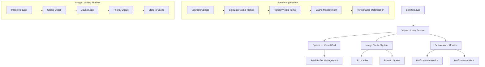

# Design Document

## Overview

O Sistema de Biblioteca Virtual de Alta Performance é projetado para renderizar bibliotecas com mais de 100.000 livros mantendo 60 FPS consistentes. O sistema utiliza virtual scrolling otimizado, cache inteligente de imagens com LRU, e monitoramento de performance em tempo real para garantir uma experiência fluida e responsiva.

## Architecture

### High-Level Architecture



### Component Architecture

O sistema é estruturado em camadas especializadas para máxima performance:

1. **Virtual Grid Layer**: Gerenciamento de scrolling virtual e cálculo de ranges visíveis
2. **Image Cache Layer**: Cache inteligente com priorização e LRU eviction
3. **Performance Monitoring Layer**: Monitoramento em tempo real e otimização automática
4. **Service Coordination Layer**: Coordenação entre componentes e otimizações

## Components and Interfaces

### 1. Optimized Virtual Grid

```rust
pub struct OptimizedVirtualGrid {
    pub visible_range: Range<usize>,
    pub item_height: f32,
    pub items_per_row: usize,
    pub total_items: usize,
    pub viewport_height: f32,
    pub scroll_offset: f32,
    pub buffer_size: usize,
    
    // Performance optimizations
    pub last_update: Instant,
    pub update_threshold: Duration,
    pub batch_size: usize,
    pub enable_preloading: bool,
}

impl OptimizedVirtualGrid {
    pub fn update_visible_range(&mut self, scroll_offset: f32) -> bool;
    pub fn get_preload_range(&self, direction: ScrollDirection) -> Range<usize>;
    pub fn optimize_settings(&mut self, metrics: &GridPerformanceMetrics);
    pub fn calculate_buffer_efficiency(&self) -> f32;
}
```

#### Virtual Scrolling Strategy

1. **Throttled Updates**: Limita atualizações a 60 FPS para evitar overhead
2. **Smart Buffering**: Buffer dinâmico baseado na direção do scroll
3. **Batch Processing**: Processa itens em lotes para melhor performance
4. **Adaptive Configuration**: Ajusta configurações baseado na performance

### 2. Optimized Image Cache

```rust
pub struct OptimizedImageCache {
    cache: LruCache<String, CachedImage>,
    max_memory_mb: usize,
    current_memory_mb: usize,
    
    // Priority management
    priority_cache: HashMap<String, Priority>,
    preload_queue: Vec<String>,
    loading_queue: HashMap<String, Instant>,
    
    // Performance metrics
    cache_hits: u64,
    cache_misses: u64,
    evictions: u64,
}

#[derive(Debug, Clone, Copy, PartialEq, Eq)]
pub enum Priority {
    Critical,   // Currently visible
    High,       // About to be visible
    Medium,     // Scroll buffer
    Low,        // Speculative preload
}
```

#### Cache Management Strategy

1. **Priority-Based Eviction**: Remove itens menos importantes primeiro
2. **Intelligent Preloading**: Preload baseado na direção do scroll
3. **Memory Management**: Controle rigoroso do uso de memória
4. **Access Pattern Learning**: Aprende padrões de acesso para otimização

### 3. Performance Monitor

```rust
pub struct PerformanceMonitor {
    metrics: Arc<RwLock<PerformanceMetrics>>,
    frame_times: Arc<RwLock<VecDeque<Duration>>>,
    memory_samples: Arc<RwLock<VecDeque<MemorySample>>>,
    targets: PerformanceTargets,
}

pub struct PerformanceMetrics {
    // Rendering metrics
    pub avg_frame_time_ms: f64,
    pub current_fps: f64,
    pub frame_drops: u64,
    
    // Memory metrics
    pub memory_usage_mb: f64,
    pub peak_memory_mb: f64,
    pub cache_hit_rate: f64,
    
    // Library metrics
    pub total_books: usize,
    pub visible_books: usize,
    pub books_per_second: f64,
}
```

#### Performance Targets

```rust
pub struct PerformanceTargets {
    pub target_fps: f64,           // 60.0 FPS
    pub max_memory_mb: f64,        // 500.0 MB
    pub min_cache_hit_rate: f64,   // 0.8 (80%)
    pub max_render_time_ms: u64,   // 16 ms (60 FPS)
}
```

### 4. Virtual Library Service

```rust
pub struct OptimizedLibraryService {
    virtual_grid: Arc<RwLock<OptimizedVirtualGrid>>,
    image_cache: Arc<RwLock<OptimizedImageCache>>,
    performance_metrics: Arc<RwLock<LibraryPerformanceMetrics>>,
    books: Arc<RwLock<Vec<Book>>>,
    filtered_books: Arc<RwLock<Vec<Book>>>,
    settings: LibrarySettings,
}

impl OptimizedLibraryService {
    pub async fn initialize(&self, books: Vec<Book>) -> Result<()>;
    pub async fn update_viewport(&self, scroll_offset: f32, viewport_height: f32) -> Result<()>;
    pub async fn get_visible_books(&self) -> Result<Vec<Book>>;
    pub async fn filter_books(&self, query: &str, status_filter: Option<ReadingStatus>) -> Result<()>;
    pub async fn optimize_performance(&self) -> Result<()>;
}
```

## Data Models

### Book Rendering Model

```rust
pub struct RenderableBook {
    pub id: String,
    pub title: String,
    pub author: String,
    pub cover_url: Option<String>,
    pub cover_cached: bool,
    pub position: GridPosition,
    pub priority: Priority,
    pub last_accessed: Instant,
}

pub struct GridPosition {
    pub row: usize,
    pub column: usize,
    pub x: f32,
    pub y: f32,
    pub width: f32,
    pub height: f32,
}
```

### Cache Models

```rust
pub struct CachedImage {
    pub data: Vec<u8>,
    pub format: ImageFormat,
    pub width: u32,
    pub height: u32,
    pub memory_size: usize,
    pub last_accessed: Instant,
    pub access_count: u32,
    pub load_time: Duration,
    pub priority: Priority,
}

pub struct CacheStats {
    pub cache_hits: u64,
    pub cache_misses: u64,
    pub evictions: u64,
    pub memory_usage_mb: usize,
    pub hit_rate: f64,
    pub preload_queue_size: usize,
}
```

## Performance Optimization Strategies

### 1. Virtual Scrolling Optimization

#### Adaptive Buffer Sizing
```rust
impl OptimizedVirtualGrid {
    pub fn optimize_buffer_size(&mut self, scroll_velocity: f32, fps: f32) {
        // Increase buffer for fast scrolling
        if scroll_velocity > 1000.0 {
            self.buffer_size = (self.buffer_size + 1).min(5);
        }
        
        // Decrease buffer for slow scrolling to save memory
        if scroll_velocity < 100.0 && fps > 55.0 {
            self.buffer_size = self.buffer_size.saturating_sub(1).max(1);
        }
    }
}
```

#### Update Throttling
```rust
impl OptimizedVirtualGrid {
    pub fn should_update(&self) -> bool {
        self.last_update.elapsed() >= self.update_threshold
    }
    
    pub fn adjust_update_threshold(&mut self, current_fps: f32) {
        if current_fps < 50.0 {
            // Reduce update frequency if FPS is low
            self.update_threshold = Duration::from_millis(32); // 30 FPS
        } else if current_fps > 70.0 {
            // Increase update frequency if FPS is high
            self.update_threshold = Duration::from_millis(8); // 120 FPS
        }
    }
}
```

### 2. Image Cache Optimization

#### Priority-Based Loading
```rust
impl OptimizedImageCache {
    pub async fn load_with_priority(&mut self, url: &str, priority: Priority) -> Result<()> {
        // Skip loading if low priority and cache is full
        if priority == Priority::Low && self.is_near_capacity() {
            return Ok(());
        }
        
        // Preempt lower priority loads
        if priority >= Priority::High {
            self.cancel_lower_priority_loads(priority).await;
        }
        
        self.start_load(url, priority).await
    }
    
    fn is_near_capacity(&self) -> bool {
        self.current_memory_mb as f32 / self.max_memory_mb as f32 > 0.9
    }
}
```

#### Intelligent Preloading
```rust
impl OptimizedImageCache {
    pub fn calculate_preload_candidates(&self, visible_range: &Range<usize>, 
                                       scroll_direction: ScrollDirection) -> Vec<String> {
        let mut candidates = Vec::new();
        
        match scroll_direction {
            ScrollDirection::Down => {
                // Preload items below visible range
                let preload_range = visible_range.end..(visible_range.end + 10);
                candidates.extend(self.get_urls_for_range(preload_range));
            }
            ScrollDirection::Up => {
                // Preload items above visible range
                let start = visible_range.start.saturating_sub(10);
                let preload_range = start..visible_range.start;
                candidates.extend(self.get_urls_for_range(preload_range));
            }
            ScrollDirection::None => {
                // Preload in both directions
                let up_range = visible_range.start.saturating_sub(5)..visible_range.start;
                let down_range = visible_range.end..(visible_range.end + 5);
                candidates.extend(self.get_urls_for_range(up_range));
                candidates.extend(self.get_urls_for_range(down_range));
            }
        }
        
        candidates
    }
}
```

### 3. Memory Management

#### Automatic Memory Optimization
```rust
impl OptimizedLibraryService {
    pub async fn optimize_memory_usage(&self) -> Result<()> {
        let current_usage = self.get_memory_usage().await;
        let target_usage = self.settings.max_cache_memory_mb as f32 * 0.8;
        
        if current_usage > target_usage {
            // Aggressive cleanup
            self.cleanup_unused_images().await?;
            self.reduce_cache_size().await?;
            self.optimize_image_quality().await?;
        }
        
        Ok(())
    }
    
    async fn cleanup_unused_images(&self) -> Result<()> {
        let mut cache = self.image_cache.write().await;
        let cutoff_time = Instant::now() - Duration::from_secs(300); // 5 minutes
        
        cache.retain(|_, image| {
            image.last_accessed > cutoff_time || image.priority >= Priority::High
        });
        
        Ok(())
    }
}
```

### 4. Parallel Processing

#### Batch Operations with Rayon
```rust
impl OptimizedLibraryService {
    pub async fn filter_books_parallel(&self, query: &str, 
                                      status_filter: Option<ReadingStatus>) -> Result<()> {
        let books = self.books.read().await;
        let query_lower = query.to_lowercase();
        
        // Parallel filtering using rayon
        let filtered: Vec<Book> = books
            .par_iter()
            .filter(|book| {
                let matches_query = query.is_empty() || 
                    book.title.to_lowercase().contains(&query_lower) ||
                    book.author.to_lowercase().contains(&query_lower);
                
                let matches_status = status_filter.is_none() || 
                    book.reading_status == status_filter.unwrap();
                
                matches_query && matches_status
            })
            .cloned()
            .collect();
        
        // Update filtered books
        let mut filtered_guard = self.filtered_books.write().await;
        *filtered_guard = filtered;
        
        Ok(())
    }
}
```

## Error Handling

### Performance Degradation Recovery

```rust
#[derive(Debug, thiserror::Error)]
pub enum PerformanceError {
    #[error("Frame rate dropped below {target} FPS (current: {current})")]
    LowFrameRate { current: f32, target: f32 },
    
    #[error("Memory usage exceeded {limit}MB (current: {current}MB)")]
    MemoryExceeded { current: f32, limit: f32 },
    
    #[error("Cache hit rate below {target}% (current: {current}%)")]
    LowCacheHitRate { current: f32, target: f32 },
    
    #[error("Render time exceeded {limit}ms (current: {current}ms)")]
    SlowRender { current: u64, limit: u64 },
}
```

### Automatic Recovery Strategies

```rust
impl OptimizedLibraryService {
    pub async fn handle_performance_degradation(&self, error: PerformanceError) -> Result<()> {
        match error {
            PerformanceError::LowFrameRate { current, target } => {
                // Reduce visual quality
                self.reduce_render_quality().await?;
                // Increase buffer size
                self.increase_scroll_buffer().await?;
                // Reduce preload aggressiveness
                self.reduce_preload_distance().await?;
            }
            
            PerformanceError::MemoryExceeded { current, limit } => {
                // Aggressive cache cleanup
                self.emergency_cache_cleanup().await?;
                // Reduce cache size
                self.reduce_cache_limits().await?;
                // Disable preloading temporarily
                self.disable_preloading().await?;
            }
            
            PerformanceError::LowCacheHitRate { current, target } => {
                // Increase cache size if memory allows
                self.increase_cache_size().await?;
                // Improve preload strategy
                self.optimize_preload_strategy().await?;
            }
            
            PerformanceError::SlowRender { current, limit } => {
                // Reduce items per batch
                self.reduce_batch_size().await?;
                // Simplify rendering
                self.enable_fast_render_mode().await?;
            }
        }
        
        Ok(())
    }
}
```

## Testing Strategy

### Performance Tests

```rust
#[cfg(test)]
mod performance_tests {
    use super::*;
    
    #[tokio::test]
    async fn test_60_fps_target() {
        let service = create_test_service_with_large_library().await;
        let mut frame_times = Vec::new();
        
        // Simulate scrolling for 2 seconds
        for i in 0..120 {
            let start = Instant::now();
            service.update_viewport(i as f32 * 10.0, 600.0).await.unwrap();
            let frame_time = start.elapsed();
            frame_times.push(frame_time);
            
            // Each frame should be under 16.67ms for 60 FPS
            assert!(frame_time.as_millis() < 17, 
                   "Frame {} took {}ms, exceeding 60 FPS target", i, frame_time.as_millis());
        }
        
        let avg_frame_time: Duration = frame_times.iter().sum::<Duration>() / frame_times.len() as u32;
        let avg_fps = 1000.0 / avg_frame_time.as_millis() as f64;
        
        assert!(avg_fps >= 60.0, "Average FPS {} below target 60", avg_fps);
    }
    
    #[tokio::test]
    async fn test_memory_limits() {
        let service = OptimizedLibraryService::new(LibrarySettings {
            max_cache_memory_mb: 100,
            ..Default::default()
        });
        
        // Load large library
        let books = create_test_books(10000).await;
        service.initialize(books).await.unwrap();
        
        // Simulate heavy usage
        for i in 0..1000 {
            service.update_viewport(i as f32 * 50.0, 600.0).await.unwrap();
            
            let memory_usage = service.get_memory_usage().await;
            assert!(memory_usage <= 100.0, 
                   "Memory usage {}MB exceeded limit 100MB", memory_usage);
        }
    }
    
    #[tokio::test]
    async fn test_large_library_performance() {
        let service = create_test_service().await;
        
        // Test with 100k books
        let books = create_test_books(100000).await;
        let start = Instant::now();
        service.initialize(books).await.unwrap();
        let init_time = start.elapsed();
        
        assert!(init_time.as_millis() < 5000, 
               "Initialization took {}ms, should be under 5000ms", init_time.as_millis());
        
        // Test scrolling performance
        let start = Instant::now();
        service.update_viewport(50000.0, 600.0).await.unwrap();
        let scroll_time = start.elapsed();
        
        assert!(scroll_time.as_millis() < 100, 
               "Scroll update took {}ms, should be under 100ms", scroll_time.as_millis());
    }
}
```

### Load Tests

```rust
#[tokio::test]
async fn test_concurrent_operations() {
    let service = Arc::new(create_test_service().await);
    let mut handles = vec![];
    
    // Simulate 50 concurrent viewport updates
    for i in 0..50 {
        let service_clone = service.clone();
        let handle = tokio::spawn(async move {
            for j in 0..100 {
                let scroll_offset = (i * 100 + j) as f32 * 10.0;
                service_clone.update_viewport(scroll_offset, 600.0).await.unwrap();
            }
        });
        handles.push(handle);
    }
    
    // Wait for all operations to complete
    for handle in handles {
        handle.await.unwrap();
    }
    
    // Verify performance metrics
    let metrics = service.get_performance_metrics().await;
    assert!(metrics.scroll_fps >= 30.0, "FPS dropped below 30 during concurrent operations");
}
```

## Deployment Considerations

### Configuration

```toml
[virtual_library]
max_cache_memory_mb = 200
items_per_row = 6
item_height = 260.0
enable_preloading = true
preload_distance = 20
scroll_buffer_size = 2

[performance]
target_fps = 60.0
max_memory_mb = 500.0
min_cache_hit_rate = 0.8
enable_monitoring = true
auto_optimization = true

[rendering]
enable_gpu_acceleration = true
vsync = true
quality_scaling = true
fast_scroll_mode = true
```

### Monitoring and Alerting

```rust
pub struct LibraryMonitoringConfig {
    pub enable_fps_monitoring: bool,
    pub enable_memory_monitoring: bool,
    pub enable_cache_monitoring: bool,
    pub alert_thresholds: AlertThresholds,
    pub metrics_export_interval: Duration,
}

pub struct AlertThresholds {
    pub min_fps: f32,
    pub max_memory_mb: f32,
    pub min_cache_hit_rate: f32,
    pub max_render_time_ms: u64,
}
```

### Platform Optimizations

#### macOS Optimizations
- Metal GPU acceleration for image rendering
- Core Animation integration for smooth scrolling
- Memory pressure handling with system notifications

#### Windows Optimizations
- DirectX integration for hardware acceleration
- Windows Performance Toolkit integration
- High DPI awareness and scaling

#### Linux Optimizations
- Vulkan support for modern GPUs
- X11/Wayland compatibility
- Memory management with cgroups awareness